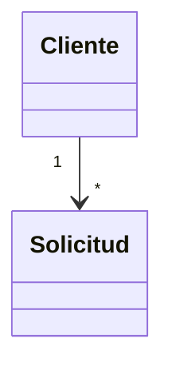

# Análisis y diseño orientado al dominio (DDD)

## Lenguaje ubicuo — lucas (SI-4)

| Término | Significado para la empresa | Ejemplo | Aclaraciones / no confundir con |
|---------|-----------------------------|---------|---------------------------------|

### Términos ambiguos aclarados

### Estados

| Concepto | Estados | Qué hace pasar de uno a otro | Quién |
|----------|---------|------------------------------|-------|

### Reglas de negocio

| Regla | Origen (conversación) | Cómo la valida el software |
|-------|-----------------------|----------------------------|

## Subdominios y bounded contexts — masita (SI-5)

### Subdominios

| Subdominio | Tipo (core / soporte / genérico) | Por qué |
|------------|----------------------------------|---------|

### Bounded contexts
_No hay cantidad obligatoria, y no tienen que coincidir con sectores ni con componentes técnicos. Justificar cada límite._

### Modelo conceptual

_Borrador: reemplazar con el modelo real que salga del relevamiento._
